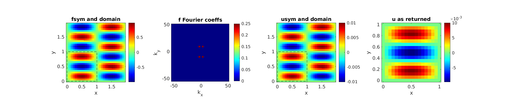
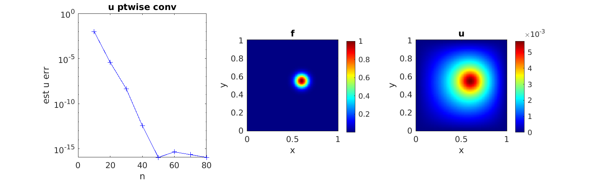
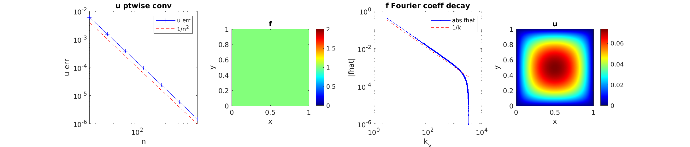
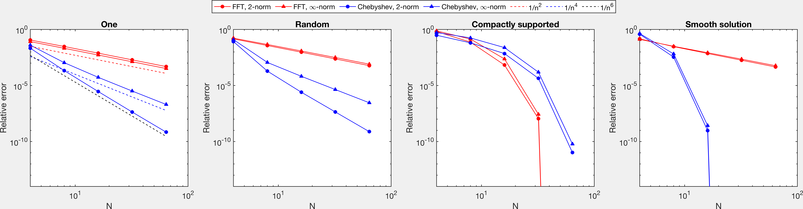

# poisson-square-spectral

MATLAB demo of FFT-based ${\cal O}(n^2 \log n)$ solver for Poisson's equation with homogeneous Dirichlet BCs on the square, on a regular $n\times n$ grid.
A comparison against a fast Chebyshev solver is also made.

Authors: Alex Barnett and Dan Fortunato (CCM, Flatiron Institute), March 2023.

### Overview

Letting $\Omega = [0,1]^2 \subset \mathbb{R}^2$, given $f$,
the BVP is to solve for $u$ obeying

$$
-\Delta u = f \qquad \mbox{ in } \Omega,
$$

$$
u = 0 \qquad \mbox{ on } \partial\Omega.
$$

The solver `spectralfft2d` in this repo answers in the affirmative the question of Fortunato-Townsend as to the existence of an optimal-complexity spectral method for the above BVP,
and in a simpler alternative fashion to their proposal [1].
However, in cases where the solution
has singularities on the domain boundary---rendering both solvers
merely algebraically convergent---the proposal of [1]
converges at least twice as fast, due to its node clustering at edges.
And if the solution is analytic in a larger domain
(something unusual in physical problems, although it may occur if the box is a subdomain in a solver for a larger domain) the proposal of [1]
may be spectrally convergent while the FFT solver merely algebraic.
We make the accuracy and speed comparisons below.

### Usage

In MATLAB/Octave, run `spectralfft2d` without arguments, which performs a set of demo and convergence tests and produces the below figure outputs. This function is documented at the bottom of this document.

To perform the comparison against the solver of [1], install a recent version
of [chebfun](https://github.com/chebfun/chebfun), add `chebfun` to your
MATLAB/Octave path, then run `fft_vs_cheb`. See below for discussion of output.


### Method

The method is simply solution by the 2D fast Fourier sine tranform
given the samples $f(i/n,j/n)$ for $i,j = 0,1,\dots,n-1$, ie, the
regular $n\times n$ grid.
The restriction to the sine series is implemented crudely
by unfolding $f$ on $[0,1]^2$ into $\tilde f$ on $[0,2]^2$,
using odd reflection symmetry about each wall, and on this
larger periodic domain using the standard bivariate Fourier series

$$
\tilde f(x,y) = \sum_{m,l\in\mathbb{Z}}
f_{ml} e^{i\pi(mx+ly)},
\qquad
\tilde u(x,y) = \sum_{m,l\in\mathbb{Z}} u_{ml} e^{i\pi(mx+ly)}.
$$

The boundary values of $f$, and their unfolded values, are set to zero,
which guarantees $f_{ml} = 0$ when either $m$ or $l$ is even.
The PDE then implies the spectral filter $u_{ml} = f_{ml}/\pi^2(m^2+l^2)$.
Numerically the 2D array $f_{ml}$ for $m,l={-n,-n+1,\dots,n-1\}$
is found from an inverse 2D FFT of the grid samples.
The multiplicative filter is then applied, and a forward 2D FFT evaluates
the series back at the (unfolded) nodes $(i/n,j/n)$ for $i,j = 0,1,\dots,2n-1$.
The code outputs just the nodes lying in $\Omega$, ie $i,j = 0,1,\dots,n$.
Use of a FDST might improve the prefactor in solution time.

### Demo outputs and discussion

1. First we test an analytic single-wavenumber forcing
   $f(x,y) = (\sin \pi x)(\sin 3\pi y)$ for which the solution is
   $u = [\pi^2 + (3\pi)^2]^{-1}f$. We see instant convergence
   to relative error around $\epsilon_{mach}$ whenever $n \ge 3$.
   Here is the unfolded $\tilde f$, 2D Fourier coefficients, unfolded $\tilde u$,
   then $u$ on $\Omega$, for the somewhat arbitrary $n=17$:



2. Now we test $f$ a Gaussian bump sufficiently narrow that its
   $\epsilon$-support lies within $\Omega$ for $\epsilon \sim 10^{-14}$.
   This means the periodization of the function is smooth apart from jumps
   at the $\epsilon$ level.
   The observed convergence with $n$ (the maximum frequency) is spectral,
   possibly even super-exponential:

   

   This is as expected since (at least down to a level $\epsilon$)
   the decay of $|f_{ml}|$ is super-exponential in
   the wavenumber $k_{ml} := \pi\sqrt{m^2+l^2}$.

3. Finally we test $f\equiv 1$, which unfolds under reflection to the
   checkerboard
   $-1$ in $[1,2]\times[0,1]$ and $[0,1]\times[1,2]$, and $+1$ again
   in $[1,2]\times[1,2]$. Thus each edge has a discontinuity in $f$,
   to the PDE gives that $u$ is $C^1$ but not $C^2$ there.
   Naively (thinking in 1D)
   one might expect that $f_{ml} = {\cal O}(1/k_{ml})$ so that
   $u_{ml} = {\cal O}(1/k_{ml}^3)$,
   and summing the truncated (1D) tail of such coefficients from $n$ to $\infty$
   one might get an error ${\cal O}(1/n^2)$.
   Indeed this algebraic rate is observed:

   

The solution for this last case is that of Poiseuille flow in a pipe
of square cross-section, or the torsion problem in elasticity for a
bar of square cross-section (eg see [2]).  The usual series solution
[3, eqn (2.47)] uses a Fourier series in, say, $y$, then solves an ODE
via particular plus homogeneous solution in $x$, giving

$$
u(x,y) = \frac{4}{\pi^3} \sum_{l=1,3,5,\dots} \frac{1}{l^3}
\left(1 - \frac{\cosh l\pi(x-1/2)}{\cosh l \pi/2}\right)
\sin l \pi y.
$$
   
This indicates $1/k^3$ decay in the $y$ Fourier direction but does not
give complete insight into the numerical convergence. Better is to get
the 2D Fourier series coefficients analytically via the Euler--Fourier
integrals
   
$$
f_{ml} = \frac{2^2}{\pi^2} \int_0^1 \sin m\pi \\, x \sin l\pi y \\, dxdy
= \frac{4}{\pi^2ml},
$$
   
so that by the PDE,

$$
u_{ml} = \frac{4}\{\pi^2ml(m^2+l^2)},
$$
   
which has $1/k^3$ decay along the axes (due to the dominant edge
singularities) but $1/k^4$ along generic directions (perhaps due to
corners). This explains the tail sum outside the box $|m|,|l| \le n$
decaying as $1/n^3$ rather than $1/n^2$.


### Comparison with Chebyshev solver of Fortunato-Townsend

**Convergence rate.**
We start with the question:
How much better is the algebraic rate of the Chebyshev grid method of Fortunato-Townsend than the $1/n^2$ we observe for the FFT solver
in the case of the $f\equiv 1$ RHS?
A conjecture by Barnett was that it should be $1/n^4$, twice the algebraic rate.
   The argument for the conjecture goes as follows. A Chebyshev series on $x\in[0,1]$
   is a Fourier series
   in $\theta$ where $\pi (x-1/2) = \cos \theta$. At the left endpoint
   $x\sim \theta^2$.
   We expect the PDE to have at a vertical edge the
   singularity $x_{+}^\alpha$ of power $\alpha=2$, which would give
   Fourier coefficient decay of $1/k^{1+\alpha} = 1/k^3$. But the
   singularity in $\theta$ is $\theta_{+}^4$, so the Chebyshev
   coefficient decay should be $1/k^{1+2\alpha} = 1/k^5$.
   Summing the tail from $k=n$ to $\infty$ gives error ${\cal O}(1/n^4)$.
   
To test this idea we run `fft_vs_cheb`, and look at the first plot (labeled "One"):



Indeed, in the $L^\infty$ norm the rate is $1/n^2$ for the FFT solver
but $1/n^4$ for the Chebyshev.
However, in the $L^2$ norm the improvement is even better: from $1/n^2$
for FFT to $1/n^6$ for Chebyshev. We believe this is due to
the node clustering localizing the error.

We now turn to the other three RHS tests in the above.
In all cases note that for the FFT solver the two norms appear
very similar (equivalent).
For the 2nd ("Random") plot, the RHS $f$ is smoothly random and, as with
$f\equiv1$, does not obey the reflection symmetry; the results are
very similar to this 1st case.

The 3rd ("Compactly supported") plot shows the same numerically
localized Gaussian $f$ as in figure 2 above; we see both solvers
are spectral with FFT slightly faster convergent. This is as expected
since the FFT solver has a node spacing $\pi/2$ times smaller than
for Chebyshev around the middle of the domain. Both norms are equivalent.

The 4th ("Smooth solution") tests $f$ for which the solution
$u(x,y)$ is a random function analytic in a larger domain,
times $x(1-x)y(1-y)$ which enforces the zero boundary conditions.
Since the Fourier series $u_{ml}$ still has $1/m^3$ decay, the FFT solver
has $1/n^2$ convergence, as with $f\equiv 1$ above.
Yet, here the Chebyshev solver is spectrally convergent because it
only cares about the domain of analyticity of $u$ or $f$.
Although such analytic solutions are often used as tests
for PDE solvers in the literature, they do not reflect the physical
singularities that occur with generic RHS and homogeneous Dirichlet
boundary conditions.
However, they can occur when the square domain is the leaf (subdomain)
in a larger solver, eg, HPS.

**Speed**. A crude timing comparison at $n=64$ nodes per dimension gives
0.0013 sec for `spectralfft2d` vs 0.019 sec for `chebfun2.poisson`.
The FFT solver is thus about 13 times faster. Since the Chebyshev
solver is iterative, this factor varies with the form of the solution.
At the much larger grid size $n=512$,
the ratio has dropped, and varies between about 0.8 and 2.7 depending
on the RHS.


### To do list

* Understand if the improved $L^2$ vs $L^\infty$ error norm in the
  Chebyshev case for $f\equiv1$ is due to corners or edges. The hint
  that it is due to a corner singularity comes from the observation
  that in the analogous 1D BVP the solution $u(x) = x(1-x)/2$ should
  have spectral accuracy with Chebyshev but only $1/n^2$ accuracy with
  sine-reflection FFT.

* Understand the case for inhomogeneous boundary data $u = g$ on
  $\partial\Omega$, which occurs in the HPS and other settings.


### Documentation

```
% SPECTRALFFT2D  Poisson solver for Dirichlet on square via spectral FFT
%
% u = spectralfft2d(rhsfun,n) returns u values on the (n+1)^2 grid defined
%  below, given handle to rhsfun for the right-hand side of form
%  f = rhsfun(x,y), on unit square domain D = [0,1]^2, with homogeneous
%  Dirichlet BCs. u solves the Poisson equation -Delta u = f with these BCs.
%
% The returned 2D grid definition is (i/n,j/n) for i,j=0,..,n. The solution
%  is zero at 1st or last point in either dimension, as per BCs.
%
% [u info] = spectralfft2d(f,n) also returns a debug struct info giving:
%  info.f    - rhsfun on 2n*2n expanded grid. Note: x fast, y slow.
%  info.u    - u on 2n*2n expanded grid.
%  info.fhat - 2D DFT of f
%  info.kg   - 1D k-grid
%
% Notes:
% 1) this answers the question in Fortunato-Townsend 2020 IMAJNA about
%    existence of a fast spectrally-accurate
%    solver for the Dirichlet square, in a simpler way (see 1st, 2nd tests).
% 2) Convergence should deteriorate to merely algebraic
%    when f does not reflect to [0,2]^2 as a smooth function (see 3rd test).
```


### References

[1]. D. Fortunato and A. Townsend, "Fast Poisson solvers for spectral methods",
IMA J. Numer. Anal. **40**, 1994--2018 (2020).

[2]. M. Bazant, "Exact solutions and physical analogies for unidirectional flows", Phys. Rev. Fluids **1**, 024001 (2016).

[3]. H. Bruus, *Theoretical Microfluidics* (Oxford University Press, Oxford, 2008).


### Acknowledgments

We thank Manas Rachh for a useful discussion.
